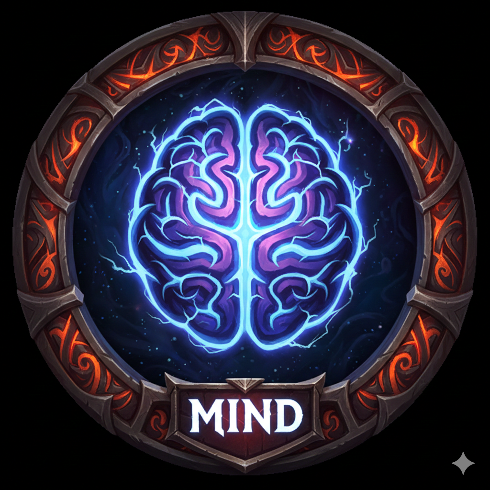

<!-- Copyright notice for this README.md template -->

<!-- MIT License

Copyright (c) 2021 Othneil Drew

Permission is hereby granted, free of charge, to any person obtaining a copy
of this software and associated documentation files (the "Software"), to deal
in the Software without restriction, including without limitation the rights
to use, copy, modify, merge, publish, distribute, sublicense, and/or sell
copies of the Software, and to permit persons to whom the Software is
furnished to do so, subject to the following conditions:

The above copyright notice and this permission notice shall be included in all
copies or substantial portions of the Software.

THE SOFTWARE IS PROVIDED "AS IS", WITHOUT WARRANTY OF ANY KIND, EXPRESS OR
IMPLIED, INCLUDING BUT NOT LIMITED TO THE WARRANTIES OF MERCHANTABILITY,
FITNESS FOR A PARTICULAR PURPOSE AND NONINFRINGEMENT. IN NO EVENT SHALL THE
AUTHORS OR COPYRIGHT HOLDERS BE LIABLE FOR ANY CLAIM, DAMAGES OR OTHER
LIABILITY, WHETHER IN AN ACTION OF CONTRACT, TORT OR OTHERWISE, ARISING FROM,
OUT OF OR IN CONNECTION WITH THE SOFTWARE OR THE USE OR OTHER DEALINGS IN THE
SOFTWARE. -->

<a name="readme-top"></a>

<!-- PROJECT SHIELDS -->
<!--
*** I'm using markdown "reference style" links for readability.
*** Reference links are enclosed in brackets [ ] instead of parentheses ( ).
*** See the bottom of this document for the declaration of the reference variables
*** for contributors-url, forks-url, etc. This is an optional, concise syntax you may use.
*** https://www.markdownguide.org/basic-syntax/#reference-style-links
-->

[![Contributors][contributors-shield]][contributors-url]
[![Forks][forks-shield]][forks-url]
[![Stargazers][stars-shield]][stars-url]
[![Issues][issues-shield]][issues-url]
[![MIT License][license-shield]][license-url]

<!-- PROJECT LOGO -->
<br />
<div align="center">
  <a href="https://github.com/silentstorm2k/Odin-Memory-Game">
    
  </a>

<h3 align="center">LOL Memory Game</h3>

  <p align="center">
    Memory game with League of Legends champions
    <br />
    <a href="https://github.com/silentstorm2k/Odin-Memory-Game"><strong>Explore the docs »</strong></a>
    <br />
    <br />
    <a href="https://odin-memory-game-rho.vercel.app/">View Demo</a>
    ·
    <a href="https://github.com/silentstorm2k/Odin-Memory-Game/issues">Report Bug</a>
    ·
    <a href="https://github.com/silentstorm2k/Odin-Memory-Game/issues">Request Feature</a>
  </p>
</div>

<!-- TABLE OF CONTENTS -->
<details>
  <summary>Table of Contents</summary>
  <ol>
    <li>
      <a href="#about-the-project">About The Project</a>
      <ul>
        <li><a href="#built-with">Built With</a></li>
      </ul>
    </li>
    <li>
      <a href="#getting-started">Getting Started</a>
      <ul>
        <li><a href="#prerequisites">Prerequisites</a></li>
        <li><a href="#installation">Installation</a></li>
      </ul>
    </li>
    <li><a href="#usage">Usage</a></li>
    <li><a href="#contributing">Contributing</a></li>
    <li><a href="#license">License</a></li>
    <li><a href="#contact">Contact</a></li>
  </ol>
</details>

<!-- ABOUT THE PROJECT -->

## About The Project

[![Product Name Screen Shot][product-screenshot]](https://odin-memory-game-rho.vercel.app/)

A simple memory game that tracks the champions (characters) you have chosen without repeating a selection.

Built with React on typescript, styled with native CSS.

Mobile first design. Clean UI changes and responsive design by principle. Appropriate ARIA tags for all elements.

Components are isolated into each component folder with its own css module file and nested components folder if any, for neat component driven development style.

Built on Riot's [DataDragonAPI](https://riot-api-libraries.readthedocs.io/en/latest/ddragon.html). With only 2 API calls.

-   One root call to fetch all champions (called once on App mount).
-   One recurring call whenever starting new game to fetch 6 unique champion images

<p align="right">(<a href="#readme-top">back to top</a>)</p>

### Built With

-   [![React][React.js]][React-url]
-   [![Typescript][Typescript-shield]][Typescript-url]
-   [![CSS][CSS-shield]][CSS-url]
-   [![HTML][HTML-shield]][HTML-url]

<p align="right">(<a href="#readme-top">back to top</a>)</p>

<!-- GETTING STARTED -->

## Getting Started

Clone the repo and install the dependencies. To start this, I used the following command and built everything from scratch.

```sh
pnpm create vite
```

Then select react-ts as the template and you good.

**You just need to follow the installation steps if you want to develop/improve this project.**

### Prerequisites

I like pnpm, I use pnpm, so you use pnpm too! (can also work with npm)

-   pnpm
    ```sh
    pnpm add -g pnpm
    ```

### Installation

1. Clone the repo
    ```sh
    git clone https://github.com/silentstorm2k/Odin-Memory-Game.git
    ```
2. Install NPM packages
    ```sh
    pnpm install
    ```

### Develop

1. Start the dev server
    ```sh
    pnpm dev
    ```
2. Open Localhost link from previous command to view the website

<p align="right">(<a href="#readme-top">back to top</a>)</p>

<!-- USAGE EXAMPLES -->

## Usage

Load into the game, click on the champion tiles you haven't clicked before. Keep track of your score.

_For more examples, please refer to the [preview](https://odin-memory-game-rho.vercel.app/)_

<p align="right">(<a href="#readme-top">back to top</a>)</p>

<!-- CONTRIBUTING -->

## Contributing

Contributions are what make the open source community such an amazing place to learn, inspire, and create. Any contributions you make are **greatly appreciated**.

If you have a suggestion that would make this better, please fork the repo and create a pull request. You can also simply open an issue with the tag "enhancement".
Don't forget to give the project a star! Thanks again!

1. Fork the Project
2. Create your Feature Branch (`git checkout -b feature/AmazingFeature`)
3. Commit your Changes (`git commit -m 'Add some AmazingFeature'`)
4. Push to the Branch (`git push origin feature/AmazingFeature`)
5. Open a Pull Request

<p align="right">(<a href="#readme-top">back to top</a>)</p>

<!-- LICENSE -->

## License

Distributed under the MIT License. See `LICENSE` for more information.

<p align="right">(<a href="#readme-top">back to top</a>)</p>

<!-- CONTACT -->

## Contact

Project Link: [https://github.com/silentstorm2k/Odin-Memory-Game](https://github.com/silentstorm2k/Odin-Memory-Game)

<p align="right">(<a href="#readme-top">back to top</a>)</p>

<!-- MARKDOWN LINKS & IMAGES -->
<!-- https://www.markdownguide.org/basic-syntax/#reference-style-links -->

[contributors-shield]: https://img.shields.io/github/contributors/silentstorm2k/Odin-Memory-Game.svg?style=for-the-badge
[contributors-url]: https://github.com/silentstorm2k/Odin-Memory-Game/graphs/contributors
[forks-shield]: https://img.shields.io/github/forks/silentstorm2k/Odin-Memory-Game.svg?style=for-the-badge
[forks-url]: https://github.com/silentstorm2k/Odin-Memory-Game/network/members
[stars-shield]: https://img.shields.io/github/stars/silentstorm2k/Odin-Memory-Game.svg?style=for-the-badge
[stars-url]: https://github.com/silentstorm2k/Odin-Memory-Game/stargazers
[issues-shield]: https://img.shields.io/github/issues/silentstorm2k/Odin-Memory-Game.svg?style=for-the-badge
[issues-url]: https://github.com/silentstorm2k/Odin-Memory-Game/issues
[license-shield]: https://img.shields.io/github/license/silentstorm2k/Odin-Memory-Game.svg?style=for-the-badge
[license-url]: https://github.com/silentstorm2k/Odin-Memory-Game/blob/master/LICENSE
[linkedin-shield]: https://img.shields.io/badge/-LinkedIn-black.svg?style=for-the-badge&logo=linkedin&colorB=555
[linkedin-url]: https://linkedin.com/in/linkedin_username
[product-screenshot]: /public/screenshot.png
[Next.js]: https://img.shields.io/badge/next.js-000000?style=for-the-badge&logo=nextdotjs&logoColor=white
[Next-url]: https://nextjs.org/
[React.js]: https://img.shields.io/badge/React-20232A?style=for-the-badge&logo=react&logoColor=61DAFB
[React-url]: https://reactjs.org/
[Vue.js]: https://img.shields.io/badge/Vue.js-35495E?style=for-the-badge&logo=vuedotjs&logoColor=4FC08D
[Vue-url]: https://vuejs.org/
[Angular.io]: https://img.shields.io/badge/Angular-DD0031?style=for-the-badge&logo=angular&logoColor=white
[Angular-url]: https://angular.io/
[Svelte.dev]: https://img.shields.io/badge/Svelte-4A4A55?style=for-the-badge&logo=svelte&logoColor=FF3E00
[Svelte-url]: https://svelte.dev/
[Laravel.com]: https://img.shields.io/badge/Laravel-FF2D20?style=for-the-badge&logo=laravel&logoColor=white
[Laravel-url]: https://laravel.com
[Bootstrap.com]: https://img.shields.io/badge/Bootstrap-563D7C?style=for-the-badge&logo=bootstrap&logoColor=white
[Bootstrap-url]: https://getbootstrap.com
[JQuery.com]: https://img.shields.io/badge/jQuery-0769AD?style=for-the-badge&logo=jquery&logoColor=white
[JQuery-url]: https://jquery.com
[Typescript-url]: https://www.typescriptlang.org/
[Typescript-shield]: https://shields.io/badge/TypeScript-3178C6?logo=TypeScript&logoColor=FFF&style=flat-square
[CSS-url]: https://developer.mozilla.org/en-US/docs/Learn_web_development/Core/Styling_basics
[CSS-shield]: https://img.shields.io/badge/CSS-239120?&style=for-the-badge&logo=css3&logoColor=white
[HTML-url]: https://developer.mozilla.org/en-US/docs/Web/HTML
[HTML-shield]: https://img.shields.io/badge/HTML-239120?style=for-the-badge&logo=html5&logoColor=white
[JEST-url]: https://jestjs.io/
[JEST-shield]: https://img.shields.io/badge/Jest-323330?style=for-the-badge&logo=Jest&logoColor=white
